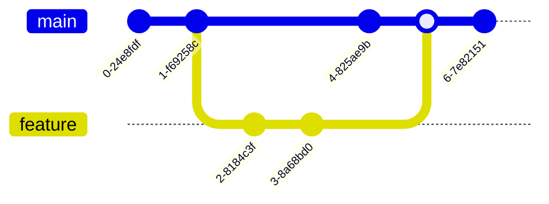

# Mermaid Diagram Tests

This file tests the Mermaid diagram rendering in the Markdown viewer.

## Flowchart Example

Here's a simple flowchart showing a decision process:


## Sequence Diagram

This sequence diagram shows the file loading process:


## Class Diagram

Here's a simple class diagram:


## State Diagram

Application states:


## Git Graph



## Error Handling Test

This should show an error message:

```mermaid
this is not valid mermaid syntax!
```

## Regular Code Block

This should still work with syntax highlighting:

```javascript
function hello() {
  console.log('Hello, World!');
}
```

## Inline Code

This is `inline code` which should work normally.
